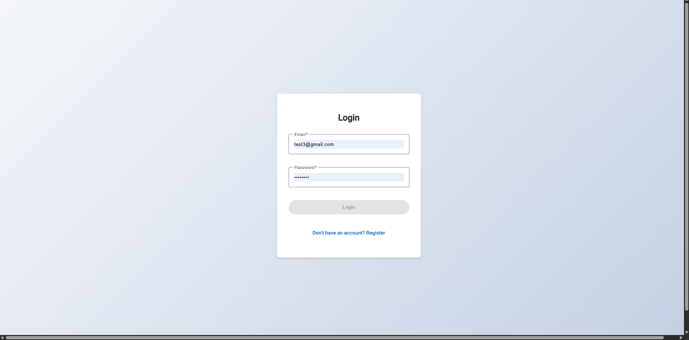
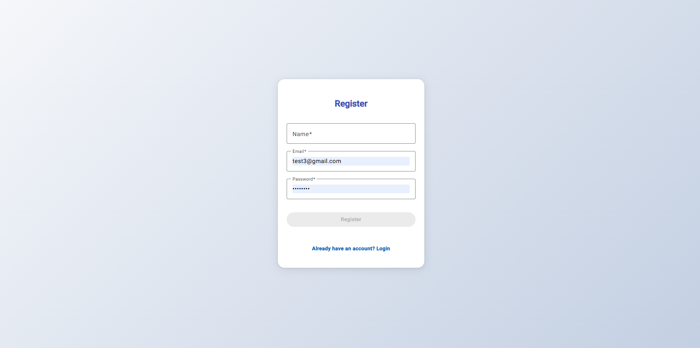
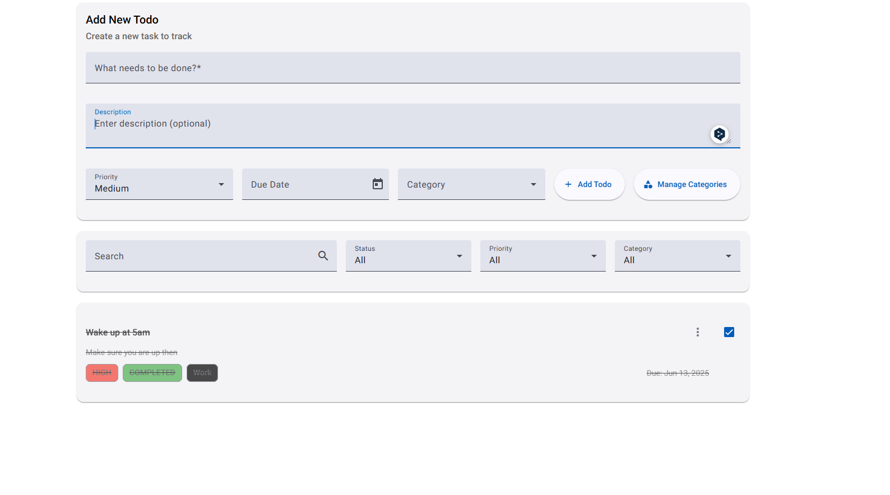
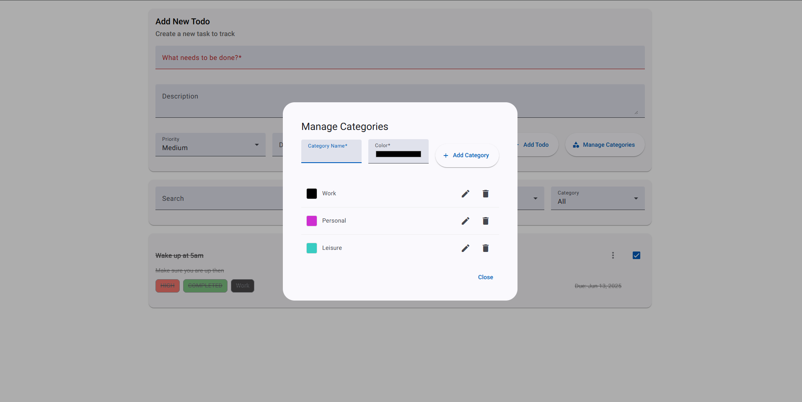

# Todo Application

A full stack Todo project done with Angular (Frontend) and Nodejs/Hono (Backend)

## Features

- User Authentication 
- CRUD operations for todos
- Task categorization
- Task prioritization
- Status tracking
- Date management
- Filter and search functionalities

## Prerequisites

- Nodejs (v18 or higher)
- NPM (v8 or higher)
- Angular (v15 or higher)
- MongoDB
- Google Cloud Platform account

## Docker Setup

### Prerequisites
- Docker (Desktop application)
- Docker Compose

### Running with Docker

1. Clone the repository:
   ```bash
   git clone https://github.com/SAMJELA-ANGELO/todo-app.git
   cd todo-app
   ```

2. Create a `.env` file in the backend directory with your environment variables:
   ```
   PORT=3000
   DATABASE_URL=mongodb://mongodb:27017/todo-app
   JWT_SECRET=secret
   ```

3. Build and start the containers:
   ```bash
   docker-compose up --build
   ```

4. Access the application:
   - Frontend: http://localhost:4200
   - Backend API: http://localhost:3000
   - MongoDB: localhost:27017
   - API Documentation: http://localhost:3000/swagger


## Local Development Setup

### Backend Setup

1. Navigate to the backend directory:
   ```bash
   cd backend/backend-todo
   ```

2. Install dependencies:
   ```bash
   npm install
   ```

3. Create a `.env` file in the backend directory with the following variables:
   ```
   PORT=3000
   DATABASE_URL=mongodb://localhost:27017/todo-app
   JWT_SECRET=secret
   ```

4. Start the backend server:
   ```bash
   npm run dev
   ```

The backend server will run on `http://localhost:3000`

### Frontend Setup

1. Navigate to the frontend directory:
   ```bash
   cd frontend/todo-frontend
   ```

2. Install dependencies:
   ```bash
   npm install
   ```

3. Create a `src/environments/environment.ts` file with the following configuration:
   ```typescript
   export const environment = {
     production: false,
     apiUrl: 'http://localhost:3000/api'
   };
   ```

4. Start the frontend development server:
   ```bash
   ng serve
   ```

The frontend application will be available at `http://localhost:4200`

## Deployment on Google Cloud Platform (GCP)

### Backend Deployment

1. Create a new project in Google Cloud Console

2. Enable the following APIs:
   - Cloud Run
   - Cloud Build
   - Container Registry

3. Create a MongoDB Atlas cluster and get the connection string

4. Set up environment variables in Cloud Run:
   ```
   DATABASE_URL=your_mongodb_connection_string
   JWT_SECRET=secret
   ```

5. Deploy using Cloud Run:
   ```bash
   gcloud builds submit --tag gcr.io/YOUR_PROJECT_ID/todo-backend
   gcloud run deploy todo-backend --image gcr.io/YOUR_PROJECT_ID/todo-backend --platform managed
   ```

### Frontend Deployment

1. update the `src/environments/environment.prod.ts` with your backend URL:
   ```typescript
   export const environment = {
     production: true,
     apiUrl: 'https://your-backend-url.run.app/api'
   };
   ```

2. build the production version:
   ```bash
   ng build --prod
   ```

3. Deploy to Firebase Hosting:
   ```bash
   npm install -g firebase-tools
   firebase login
   firebase init
   firebase deploy
   ```

## Using the Application

### Authentication

1. Register a new account

2. Login:
   - Enter your email and password
   - Click "Login"

### Managing Todos

1. Creating a Todo:
   - Fill in the title (required)
   - Add an optional description
   - Select priority (High, Medium, Low)
   - Set a due date (optional)
   - Choose a category (optional)
   - Click "Add Todo"

2. Editing a Todo:
   - Click the three dots menu on a todo item
   - Select "Edit"
   - Modify the details
   - Click "Save"

3. Deleting a Todo:
   - Click the three dots menu
   - Select "Delete"
   - Confirm deletion

4. Marking a Todo as Complete:
   - Click the checkbox next to the todo item

### Managing Categories

1. Creating a Category:
   - Click "Manage Categories"
   - Click "Add Category"
   - Enter category name
   - Choose a color
   - Click "Save"

2. Using Categories:
   - Assign categories to todos when creating or editing
   - Filter todos by category using the category filter

### Filtering and Searching

1. Search:
   - Use the search bar to find todos by title or description

2. Filters:
   - Filter by status (All, Pending, In Progress, Completed)
   - Filter by priority (All, High, Medium, Low)
   - Filter by category

## Images of the Application
### Authentication forms



### Image of Todo dashbord
   

### Image of category 
    


## License

This project is licensed under the MIT License - see the LICENSE file for details. 